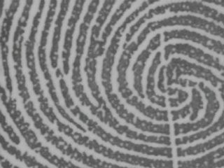

# Identity-aware Fingerprint Database (IAF) models

Our method of generating synthetic fingerprints divided into two stages. The first stage is capable of creating new fingerprint identities from five fingerprint classes separately, and the second stage models factors such as sample area, orientation, deformation, and texturing.

<p align="center">  </p>


# 1. Master fingerprint generation

-  ***FastGAN models*** - Left loop, whorl, right loop, tented and regular arch:  https://drive.google.com/drive/folders/1ZppbRqviDI_6HSFVCrUmGZOxjA-jQCCu?usp=sharing

  Dependences: 
  ```bash
  $ pip install lightweight-gan==0.20.4 torch==1.9.1+cu111 torchvision==0.10.1+cu111 torchaudio==0.9.1 -f https://download.pytorch.org/whl/torch_stable.html 
  ```

  Inference example: 
  ```bash
  $ CUDA_VISIBLE_DEVICES=0 lightweight_gan --name LOOP_RIGHT --load-from 138 --generate --generate-types default --num-image-tiles 1000
  ```
  
# 2. CycleGAN-based texturing

- ***Texturing with unpaired images:*** At the end of this step, there is a model capable of binarizing high-resolution fingerprints.
- ***Texturing with paired images:***  Currently, this model is capable of converting seed images into realistic high-resolution images.
- ***Style adaptation using unpaired images:*** Ccquisition sessions at different times can generate changes in fingerprint images, which can be caused by changes in the imaging sensor or natural changes in human skin. This step simulates that process. 
     
-  ***CycleGAN models*** - https://drive.google.com/drive/folders/1bMvsYncRjUO0yuR-ZSEMJEecg8vmj1n5?usp=sharing

- Environment

    - Python 3.6

    - TensorFlow 2.2, TensorFlow Addons 0.10.0

    - OpenCV, scikit-image, tqdm, oyaml

    - *we recommend [Anaconda](https://www.anaconda.com/distribution/#download-section) or [Miniconda](https://docs.conda.io/en/latest/miniconda.html#linux-installers), then you can create the TensorFlow 2.2 environment with commands below*

        ```console
        conda create -n tensorflow-2.2 python=3.6

        source activate tensorflow-2.2

        conda install scikit-image tqdm tensorflow-gpu=2.2

        conda install -c conda-forge oyaml

        pip install tensorflow-addons==0.10.0
        ```

    - *NOTICE: if you create a new conda environment, remember to activate it before any other command*

        ```console
        source activate tensorflow-2.2
        ```
- Information: 
  - Edit the "settings.yml" file to change the path of your dataset.
  - You need to put the inference images into the "testA/" folder of your dataset.
  - Extract the models into the output folders and run the model with the command:
 ```bash
  $ CUDA_VISIBLE_DEVICES=0 CUDA_VISIBLE_DEVICES=0 python3 test.py --experiment_dir ./output/MODEL/
  ```
Don't forget to replace "MODEL" for the name of the model you want to use.

# 3. Fingerprint class annotations
- NIST SD300a dataset:  https://raw.githubusercontent.com/iafdatabase/iafmodels/main/SD300a_annotation.csv

# 4. Repositories
- https://github.com/lucidrains/lightweight-gan
- https://github.com/LynnHo/CycleGAN-Tensorflow-2

## Citations

```bibtex
@inproceedings{
    anonymous2021towards,
    title   = {Towards Faster and Stabilized {\{}GAN{\}} Training for High-fidelity Few-shot Image Synthesis},
    author  = {Anonymous},
    booktitle = {Submitted to International Conference on Learning Representations},
    year    = {2021},
    url     = {https://openreview.net/forum?id=1Fqg133qRaI},
    note    = {under review}
}
```

```bibtex
@Article{	  zhupie17,
  title		= {Unpaired Image-to-Image Translation using Cycle-Consistent
		  Adversarial Networks},
  author	= {Jun{-}Yan Zhu and Taesung Park and Phillip Isola and
		  Alexei A. Efros},
  year		= 2017,
  journal	= {CoRR},
  volume	= {abs/1703.10593},
  url		= {http://arxiv.org/abs/1703.10593},
  archiveprefix	= {arXiv},
  eprint	= {1703.10593},
  timestamp	= {Mon, 13 Aug 2018 16:48:06 +0200},
  biburl	= {https://dblp.org/rec/bib/journals/corr/ZhuPIE17},
  bibsource	= {dblp computer science bibliography, https://dblp.org}
}
```

